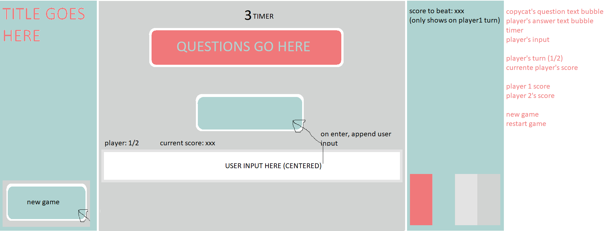

# BE QUICK! ϟ
[Click here for a link to the game](https://knownopear.github.io/project-1/)

### Overview

BE QUICK! ϟ is a fun and fast game developed with the intent of pitting its players against each other with questions of typing dexterity, mathematical skill and logic questions. There is no room for error, and once a player makes a mistake their turn is forfeited and the baton is passed on to the next player.

---

### Number of Players
BE QUICK! ϟ currently supports 2 players

---

### Technologies Used
* **HTML5**
* **CSS3**
* **JQuery**

---

### Development Approach
At the beginning of development, I played around with the idea of a multiplayer follow-the-leader-type of game. However, I quickly realised that having multiple players simultaneously following a leader would require there to be multiple inputs of the same type. For example, if two players had to follow the same string of text, they would require two seperate keyboards for a simultaneous input. 

With that in mind, I decided to have it as a turn-based game instead, with turns starting with player 1. I started writing the pseudo-code of what I envisoned the game to be - 
* Player clicks a 'Start Game' button
* There is a short delay
* The game initialises
* Copycat(the thing you have to follow) will generate and show a problem (math, logic, string, etc)
* A timer will appear and count downwards
* The player will have to answer within the time limit
* If the timer reaches 0 or the player's answer is wrong, his turn ends
* If the player's answer is correct, the game will continue indefinitely until the timer runs out or the answer is wrong
* Timer resets with every correct answer
* When the current player loses, record their score on a sidebar to show the next player what score they have to beat and change the players
* There is a short delay
* Initialise game and repeat steps

---

### Logo Design

The logo was modeled after a lightning bolt to keep in line with the theme of being quick

---

### Layout Design

A quick design of the layout that includes the color scheme

---

### Color Scheme
I decided to go with a neutral, light color scheme with a splash of contrast. This is to ensure that the color does not distract the players from the logical problems they will be facing
* White - #FFFFFF
* Muted Red - #F0787A
* Muted Teal - #AFD3D1 
* Light Grey - #E1E3E4
* Dark Grey - #D1D3D2

---

### Important Functions
* generateNewProb();
This function chooses from 3 different types of logic questions 
1) generateString() - Generates a random string of letters with random cases. There is no capital I to avoid confusing the players
2) generateOpenEnded() - Generates an open-ended question of math (Is x +- y = z? yes/no)
3) generateMathEquation() - Generates a random equation
and displays them to the player. There is a higher chance of getting a string and a math equation than an open-ended question.

* increaseDifficulty()
This function increases with every question that the player gets right, and affects all of the generated questions that come after. When the player changes, the difficulty level resets.

---

### Plans Ahead
I plan to allow for more than 2 players, and to increase the type of questions that can be endlessly generated. I also plan to shorten the code.

---

### Things I have learnt
* console.log() & alert() are my best friends
* google is the most useful tool a developer can have
* if you are burnt out from hours of looking at code, take a break! It is okay to have some time off

---
Wow you made it to the end

